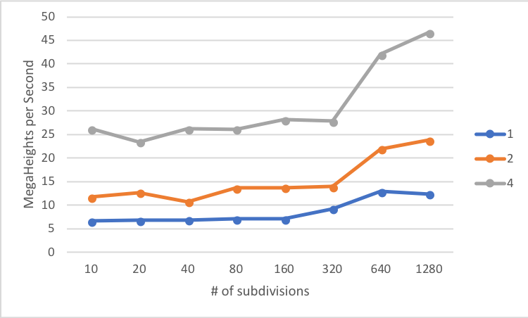
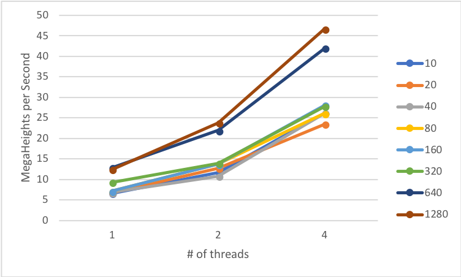

# Tell what machine you ran this on
I am running on my PC:

* CPU: **i5-4690K CPU**
* Operating System: **Arch Linux**
* GPU: **NVIDIA GeForce GTX 760**

To compile program, run *./runPro*

I have made the **number of tries** to be fixed at **100**.

Check the end of the document for actual output from running the program.

# What do you think the actual volume is?

Estimation of the actual volume from running the program:

NUMT / NUMNODES | 10 | 20 | 40 | 80 | 160 | 320 | 640 | 1280
------------- | ------------- | ------------- | ------------- | ------------- | ------------- | ------------- | ------------- | -------------
1 | 26.77 | 26.12 | 25.73 | 25.53 | 25.42 | 25.37 | 25.34 | 25.33
2 | 26.77 | 26.12 | 25.73 | 25.53 | 25.42 | 25.37 | 25.34 | 25.33
4 | 26.77 | 26.12 | 25.73 | 25.53 | 25.42 | 25.37 | 25.34 | 25.33

I would assume that as the number of subdivision increases, the accuracy reduces because the machine will round off in every iteration, so as the number of iterations increases, the number of processed rounding increases, which leads to decreases the accuracy of the targeted output. Therefore, I think the actual volume is 26.77 as the number of iterations (subdivisions).

# Show the performances you achieved in tables and graphs as a function of NUMNODES and NUMT

Performances Table:

NUMT / NUMNODES | 10 | 20 | 40 | 80 | 160 | 320 | 640 | 1280
------------- | ------------- | ------------- | ------------- | ------------- | ------------- | ------------- | ------------- | -------------
1 | 6.62 | 6.8 | 6.84 | 7.1 | 7.11 | 9.28 | 12.89 | 12.41
2 | 11.71 | 12.71 | 10.77 | 13.69 | 13.74 | 13.92 | 21.92 | 23.82
4 | 26.21 | 23.48 | 26.18 | 26.14 | 28.15 | 27.82 | 42.02 | 46.7

Performances Graph:

{width=50%}{width=50%}


# What patterns are you seeing in the speeds?
KKK

# Why do you think it is behaving this way?
KKK

# What is the Parallel Fraction for this application, using the Inverse Amdahl equation?
$T_i = \frac{\sum_{j=1}^{8}t_j}{8}$, where $T_i$ is the average of all subdivision time, $t$, for a certain $i$ number of threads.

$S_n = \frac{T_1}{T_n}$

$S_2 = 1.83\ \&\ S_4 = 3.55$

$F_n = \frac{n}{(n-1)}(1-\frac{1}{S_n})$

$F_2 = \frac{2}{(1)}(1-\frac{1}{1.83}) = 0.90$

$F_4 = \frac{4}{(3)}(1-\frac{1}{3.55}) = 0.96$

The Parallel Fraction for two and four threads are 0.90 and 0.96, respectively.

# Given that Parallel Fraction, what is the maximum speed-up you could ever get?

$(S_{max})_n = \frac{1}{(1-F_n)}$

$(S_{max})_2 = \frac{1}{(1-0.9)} \approx 10$

$(S_{max})_4 = \frac{1}{(1-0.96)}\approx 25$

The maximum speed-up for two and four threads are ~10 and ~25, respectively.

# Output files

*output.txt*:

```{bash echo=FALSE}
cat output.txt
```

*data1.cvs*
```{bash echo=FALSE}
echo -e "Estimated Volume, Max. MegaHeights per Seconds, Avg. MegaHeights per Second, and Avg. Time"
cat data1.cvs
echo -e "S_n and F_n\n"
```
