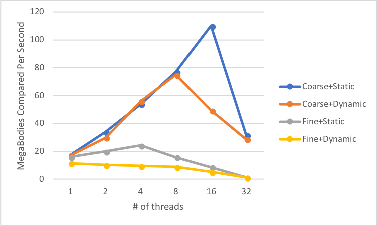
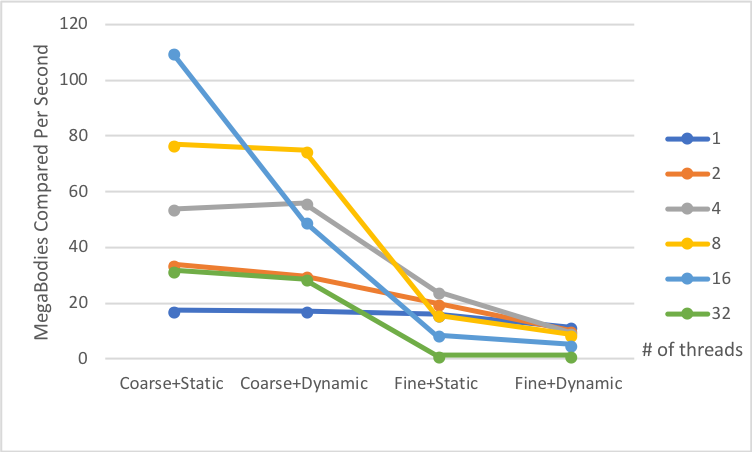

# Tell what machine you ran this on

I am running on the ENGR Server.

To compile program, run *./runPro*

I have made the **number of tries** to be fixed at **100**.

Check the end of the document for the actual output from running the program.

# What do you think the actual volume is?

Estimation of the actual volume from running the program:

NUMT / NUMNODES | 10 | 20 | 40 | 80 | 160 | 320 | 640 | 1280
------------- | ------------- | ------------- | ------------- | ------------- | ------------- | ------------- | ------------- | -------------
1 | 26.77 | 26.12 | 25.73 | 25.53 | 25.42 | 25.37 | 25.34 | 25.33
2 | 26.77 | 26.12 | 25.73 | 25.53 | 25.42 | 25.37 | 25.34 | 25.33
4 | 26.77 | 26.12 | 25.73 | 25.53 | 25.42 | 25.37 | 25.34 | 25.33

As the number of subdivision increases the approximation for the Trapezoidal rule increases, so I would assume that the actual volume is 25.33.

# Show the performances you achieved in tables and graphs as a function of NUMNODES and NUMT

Performances Table:

NUMT / NUMNODES | 10 | 20 | 40 | 80 | 160 | 320 | 640 | 1280
------------- | ------------- | ------------- | ------------- | ------------- | ------------- | ------------- | ------------- | -------------
1 | 6.62 | 6.8 | 6.84 | 7.1 | 7.11 | 9.28 | 12.89 | 12.41
2 | 11.71 | 12.71 | 10.77 | 13.69 | 13.74 | 13.92 | 21.92 | 23.82
4 | 26.21 | 23.48 | 26.18 | 26.14 | 28.15 | 27.82 | 42.02 | 46.7

Performances Graph:

{width=50%}{width=50%}


# What patterns are you seeing in the speeds?

It seems that as the number of subdivisions increases the speeds increases for all threads. In addition, the speeds for 4 threads is greater than 2 threads and 1 thread, and the speeds for 2 threads is greater than 1 thread.

$T_i = \frac{\sum_{j=1}^{8}t_j}{8}$, where $T_i$ is the average of all subdivision time, $t$, for a certain $i$ number of threads.

$S_n = \frac{T_1}{T_n}$

$S_2 = \frac{T_1}{T_2} = 1.83$

$S_4 = \frac{T_1}{T_4} = 3.55$

# Why do you think it is behaving this way?

The speedup ratio is greater than 1 due to the average elapsed time when using one thread is greater than the average elapsed time when using two or four threads, which means that **when using two or four threads it takes less time to process compare to using one thread to do the same task**. In addition, the speedup when using 4 threads is greater than the speedup when using 2 threads because, when using 4 threads, it takes less time to process same task compared to the timing when using 2 threads.

# What is the Parallel Fraction for this application, using the Inverse Amdahl equation?

$F_n = \frac{n}{(n-1)}(1-\frac{1}{S_n})$

$F_2 = \frac{2}{(1)}(1-\frac{1}{1.83}) = 0.90$

$F_4 = \frac{4}{(3)}(1-\frac{1}{3.55}) = 0.96$

$F = \frac{F_2 + F_4}{2} = 0.93$

The Parallel Fraction is 0.93.

# Given that Parallel Fraction, what is the maximum speed-up you could ever get?

$(S_{max}) = \frac{1}{(1-F)}$

$(S_{max}) = \frac{1}{(1-0.93)} \approx 14$

The maximum speed-up is ~14.

# Output files

*output.txt*:

```{bash echo=FALSE}
cat output.txt
```

*data1.cvs*
```{bash echo=FALSE}
echo -e "Estimated Volume, Max. MegaHeights per Seconds, Avg. MegaHeights per Second, and Avg. Time"
cat data1.cvs
echo -e "S_n and F_n\n"
```
