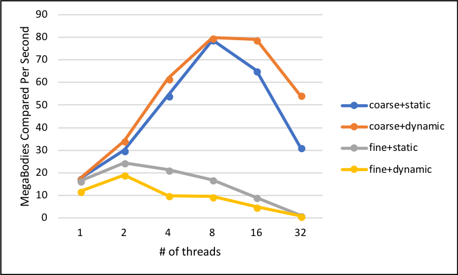
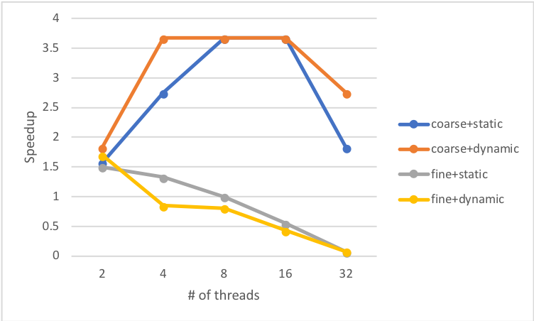

```{r setup, include=FALSE}
knitr::opts_chunk$set(echo = TRUE)
```

# Report

## 1. Tell what machine you ran this on

I am running on the ENGR Server.

To compile program, run *./runPro*

Note: all figures are the end of the document.

## 2. Create a table with your results.


| NUMTHREADS | coarse+static | coarse+dynamic| fine+static | fine+dynamic |
| -------- | -------- | -------- | -------- | -------- |
| 1     | 17.50, 17.42, 16.39, 11.82
| 2     | 30.06, 34.11, 24.52, 19.08
| 4     | 54.17, 61.75, 21.36, 10.01
| 8     |78.86, 79.81, 16.89, 9.59
| 16    | 65.18, 78.98, 9.12, 4.98
| 32    | 31.39, 54.36, 1.21, 0.97

## 3. Draw a graph. The X axis will be the number of threads. The Y axis will be the performance in whatever units you sensibly choose. On the same graph, plot 4 curves:

Refer to Figure 1

{width=50%}

## 4. What patterns are you seeing in the speeds?

| NUMTHREADS | coarse+static | coarse+dynamic| fine+static | fine+dynamic |
| -------- | -------- | -------- | -------- | -------- |
| 2     | 1.57 | 1.83 | 1.50 | 1.70 |
| 4     | 2.75 | 3.67 | 1.33 | 0.85 |
| 8     | 3.67 | 3.67 | 1.00 | 0.81 |
| 16    | 3.67 | 3.67 | 0.55 | 0.43 |
| 32    | 1.83 | 2.75 | 0.07 | 0.08 |

Refer to Figure 2

{width=50%}

First, it seems that for Coarse approach, either the static or the dynamic, as we increase the number of threads the speedup increases, which means that the program is being optimized by using the threads, which increases to the threshold of 3.67 ratio. In the other hand, for Fine approach, either the static or the dynamic, as we increase the number of threads the speed decreases, which means the program behaves worse when using multiple threads compared to one.

Second, it seems that the static method, for either the Coarse or the Fine approach, behaving better compared to when using the dynamic method, for either the Coarse or the Fine appriach.

Third, it seems that for either approaches and either methods when using 16 threads is better than using 32 threads.

## 5. Why do you think it is behaving this way?

First, I think the reason why Coarse approach, either the static or the dynamic, is behaving better than the Fine approach, either the static or dynamic, because the Coarse approach uses multiple threads in every iteration of i (first loop, main loop) compared to the Fine approach, which uses multiple threads in every iteration of j (second loop, inner loop). Therefore, the Fine approach requires to join in every single iteration of i (first loop, main loop) compared to the Coarse approach.

Second, I think the reason why static method, for either the Coarse or the Fine approach, is behaving better than the dynamic method, for either the Coarse or the Fine approach, because the static is pre-assigning tasks to threads before they start working compared to dynamic which assigns when threads are working. In addition, another reason for this behavior is beucase the overhead when using dynamic method.

Third, as I am using ENGR servers, which have 24 cores, I think the reason why when using 16 threads is better than using 32 threads for either approaches and either methods becuase the number of requested threads to do a job is greater, 32 than the number of cores, 24, therefore, when having more threads than number of cores the speedup decreases. 

