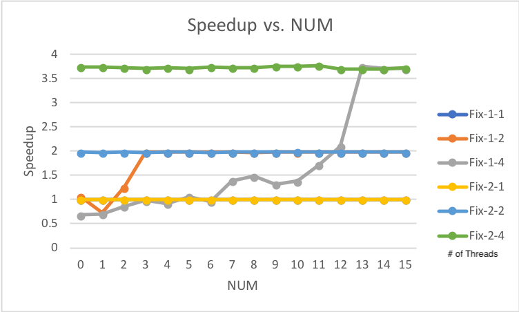

# Tell what machine you ran this on
I am running on my PC:

* CPU: **i5-4690K CPU**
* Operating System: **Arch Linux**
* GPU: **NVIDIA GeForce GTX 760**

To compile the program, please run *./runPro*

# Create a table with your results.

| NUM/NUMT | Fix-1-1 | Fix-1-2 | Fix-1-4 | Fix-2-1 | Fix-2-2 | Fix-2-4 | 
|-----|---------|---------|---------|---------|---------|---------| 
| 0   | 1       | 1.06    | 0.68    | 1       | 1.98    | 3.74    | 
| 1   | 1       | 0.73    | 0.7     | 1       | 1.97    | 3.74    | 
| 2   | 1       | 1.25    | 0.86    | 1       | 1.98    | 3.73    | 
| 3   | 1       | 1.98    | 0.98    | 1       | 1.97    | 3.71    | 
| 4   | 1       | 1.98    | 0.92    | 1       | 1.98    | 3.73    | 
| 5   | 1       | 1.98    | 1.06    | 1       | 1.98    | 3.71    | 
| 6   | 1       | 1.98    | 0.96    | 1       | 1.97    | 3.74    | 
| 7   | 1       | 1.98    | 1.39    | 1       | 1.98    | 3.73    | 
| 8   | 1       | 1.97    | 1.48    | 1       | 1.98    | 3.73    | 
| 9   | 1       | 1.98    | 1.32    | 1       | 1.98    | 3.76    | 
| 10  | 1       | 1.98    | 1.38    | 1       | 1.99    | 3.76    | 
| 11  | 1       | 1.98    | 1.72    | 1       | 1.98    | 3.77    | 
| 12  | 1       | 1.98    | 2.1     | 1       | 1.98    | 3.7     | 
| 13  | 1       | 1.98    | 3.75    | 1       | 1.98    | 3.7     | 
| 14  | 1       | 1.98    | 3.71    | 1       | 1.98    | 3.7     | 
| 15  | 1       | 1.98    | 3.71    | 1       | 1.98    | 3.72    | 

# Draw a graph.

Refer to Figure \#1

# What patterns are you seeing in the performance?

For Fix \#1, it seems that as the number as NUM increases, the speedup increases, however, it will convereage to a point, depends on the number of threads that it has been used and number of CPU cores of the machine that has been used to compile the program, so it can't excceed that point. In addition, when using 4 threads, the speedup starts below 1 and then increases slowly compared to when using just 2 threads, which starts on 1 and increases linearly to 2, and when using 4 threads, the speedup increases and decreases, but it will reach to a point that can't excceed.

For Fix \#2, it seems that as NUM increases, the speedup doesn't change a lot for every thread, and it starts at max speed that the machine can reach.

# Why do you think it is behaving this way?

It seems that Fix \#2 is behaving better than Fix #1 in all cases, which is due to the fact that Fix \#2 is stopping false sharing fully compared to Fix #1, which tries to reduce it.
